<picture>
  <source media="(prefers-color-scheme: dark)" srcset="dark.svg">
  <source media="(prefers-color-scheme: light)" srcset="light.svg">
  
</picture>

  
  
  
  

  

---

### `> whoami`

Full Stack Developer specializing in **Full Stack**, **AI**, and **Cloud**. Building real-world applications with the MERN stack, Python, Java, and cloud infrastructure. I care about writing clean, scalable code and shipping products that people actually use.

---

### `> tech --list`

- **Languages & Core:** `C`, `C++`, `Java`, `Python`, `JavaScript`, `HTML5`, `CSS3`
- **Frameworks & Libraries:** `React.js`, `Next.js`, `Node.js`, `Express.js`, `Tailwind CSS`
- **Databases & Cloud:** `MongoDB`, `PostgreSQL`, `Firebase`, `Docker`, `AWS`
- **Tools & Environment:** `Git`, `GitHub`, `Linux`, `VS Code`, `Vercel`